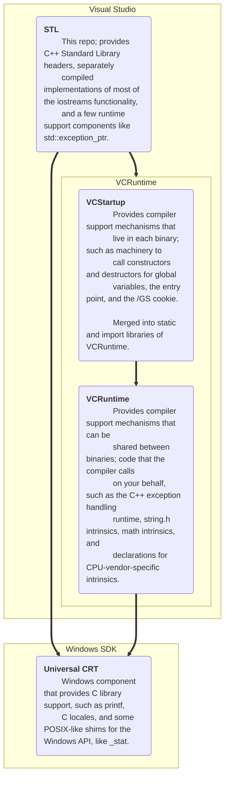

# Microsoft's C++ Standard Library

This is the official repository for Microsoft's implementation of the C++ Standard Library (also known as the STL),
which ships as part of the MSVC toolset and the Visual Studio IDE.

* Our [Changelog][] tracks which updates to this repository appear in each VS release.
* Our [Status Chart][] displays our overall progress over time.
* Join our [Discord server][].

[][Pipelines]

# What This Repo Is Useful For

If you're a programmer who just wants to use the STL, you **don't** need this repo. Simply install the Visual Studio IDE
and select the "Desktop development with C++" workload.

If you want to participate in the STL's development, welcome! You can report issues, comment on pull requests, and learn
about what we're working on. You can also submit pull requests to fix bugs or add features: see [CONTRIBUTING.md][] for
more information.

Finally, you can take our code and use it in other apps and libraries (according to the terms of our license, like
everything else).

# GitHub Migration Status

We're in the process of moving all of our work on the STL to GitHub. Current status:

* Code: **Done.** Our source code is available under the Apache License v2.0 with LLVM Exception. (See
[LICENSE.txt][] and [NOTICE.txt][] for more information.)

* Build System: **In progress.** We're working on a CMake build system, which is currently capable of building one
flavor of the STL (native desktop). We need to extend this to build all of the flavors required for the MSVC toolset
(e.g. `/clr`, `/clr:pure`, OneCore, Spectre). Until that's done, we're keeping our legacy build system around in the
`stl/msbuild` subdirectory. (We're keeping those files in this repo, even though they're unusable outside of Microsoft,
because they need to be updated whenever source files are added/renamed/deleted. We'll delete the legacy machinery as
soon as possible.)

* Tests: **In progress.** We rely on three test suites: std, tr1, and [libcxx][]. We've partially ported std and tr1,
and fully ported libcxx to run under [lit][] using the various configurations/compilers we test internally.

* Continuous Integration: **In progress.** We've set up Azure Pipelines to validate changes to the repository.
Currently, it builds the STL (native desktop for x86, x64, ARM, and ARM64). Also, it strictly verifies that all of our
files have been formatted with [clang-format][] and follow our other whitespace conventions.

* Contribution Guidelines: **Coming soon.** Working on the STL's code involves following many rules. We have codebase
conventions, Standard requirements, Microsoft-specific requirements, binary compatibility (ABI) requirements, and more.
We're eager to begin accepting features and fixes from the community, but in addition to setting up a CI system, we need
to write down all of the rules that are currently stored in our brains. (The ABI rules may be useful to other C++
libraries.)

* Issues: **In progress.** We're going to use GitHub issues to track all of the things that we need to work on. This
includes C++20 features, [LWG issues][], conformance bugs, performance improvements, and other todos. There are
approximately 200 active bugs in the STL's Microsoft-internal database; we need to manually replicate all of them to
GitHub issues. Currently, the [cxx20 tag][] and [LWG tag][] are done; every remaining work item is tracked by a GitHub
issue. The [bug tag][] and [enhancement tag][] are being populated.

* Plans: **In progress.** We're writing up our [Roadmap][].

# Goals

We're implementing the latest C++ Working Draft, currently [N4950][], which will eventually become the next C++
International Standard. The terms Working Draft (WD) and Working Paper (WP) are interchangeable; we often
informally refer to these drafts as "the Standard" while being aware of the difference. (There are other relevant
Standards; for example, supporting `/std:c++14` and `/std:c++17` involves understanding how the C++14 and C++17
Standards differ from the Working Paper, and we often need to refer to the C Standard Library and ECMAScript regular
expression specifications.)

Our primary goals are conformance, performance, usability, and compatibility.

* Conformance: The Working Paper is a moving target; as features and LWG issue resolutions are added, we need to
implement them. That can involve a lot of work because the STL is required to behave in very specific ways and to
handle users doing very unusual things.

* Performance: The STL needs to be extremely fast at runtime; speed is one of C++'s core strengths and most C++
programs use the STL extensively. As a result, we spend more time on optimization than most general-purpose libraries.
(However, we're wary of changes that improve some scenarios at the expense of others, or changes that make code
significantly more complicated and fragile. That is, there's a "complexity budget" that must be spent carefully.)

* Usability: This includes parts of the programming experience like compiler throughput, diagnostic messages, and
debugging checks. For example, we've extensively marked the STL with `[[nodiscard]]` attributes because this helps
programmers avoid bugs.

* Compatibility: This includes binary compatibility and source compatibility. We're keeping VS 2022 binary-compatible
with VS 2015/2017/2019, which restricts what we can change in VS 2022 updates. (We've found that significant changes
are possible even though other changes are impossible, which we'll be documenting in our Contribution Guidelines soon.)
While there are a few exceptions to this rule (e.g. if a feature is added to the Working Paper, we implement it, and
then the feature is significantly changed before the International Standard is finalized, we reserve the right to break
binary compatibility because `/std:c++latest` offers an experimental preview of such features), binary compatibility
generally overrides all other considerations, even conformance. Source compatibility refers to being able to
successfully recompile user code without changes. We consider source compatibility to be important, but not
all-important; breaking source compatibility can be an acceptable cost if done for the right reasons in the right way
(e.g. in a controlled manner with escape hatches).

# Non-Goals

There are things that we aren't interested in doing with this project, for various reasons (most importantly, we need to
focus development effort on our goals). Some examples:

* Non-goal: Porting to other platforms.

* Non-goal: Adding non-Standard extensions.

* Non-goal: Implementing Technical Specifications. (We're prioritizing features in the Working Paper. Occasionally, we
might implement some or all of a TS, often when we're working on the specification itself.)

If you're proposing a feature to WG21 (the C++ Standardization Committee), you're welcome (and encouraged!) to use our
code as a base for a proof-of-concept implementation. These non-goals simply mean that we're unable to consider pull
requests for a proposed feature until it has been voted into a Working Paper. After that happens, we'll be delighted to
review a production-ready pull request.

# Reporting Issues

You can report STL bugs here, where they'll be directly reviewed by maintainers. You can also report STL bugs through
[Developer Community][], or the VS IDE (Help > Send Feedback > Report a Problem...).

**Please help us** efficiently process bug reports by following these rules:

* Only STL bugs should be reported here. If it's a bug in the compiler, CRT, or IDE, please report it through Developer
Community or Report A Problem. If it's a bug in the Windows SDK, please report it through the [Feedback Hub][hub] app.
If you aren't sure, try to reduce your test case and see if you can eliminate the STL's involvement while still
reproducing the bug.

* You should be reasonably confident that you're looking at an actual implementation bug, instead of undefined behavior
or surprising-yet-Standard behavior. Comparing against other implementations can help (but remember that implementations
can differ while conforming to the Standard); try [Compiler Explorer][]. If you still aren't
sure, ask the nearest C++ expert.

* You should prepare a self-contained command-line test case, ideally as small as possible. We need a source file, a
command line, what happened (e.g. a compiler error, runtime misbehavior), and what you expected to happen. By
"self-contained", we mean that your source file has to avoid including code that we don't have. Ideally, only CRT and
STL headers should be included. If you have to include other MSVC libraries, or the Windows SDK, to trigger an STL bug,
that's okay. But if you need parts of your own source code to trigger the STL bug, you need to extract that for us. (On
Developer Community, we'll accept zipped IDE projects if you have no other way to reproduce a bug, but this is very
time-consuming for us to reduce.)

* A good title is helpful. We prefer "`<header_name>`: Short description of your issue". You don't usually need to
mention `std::` or C++. For example, "`<type_traits>`: `is_cute` should be true for `enum class FluffyKittens`".

It's okay if you report an apparent STL bug that turns out to be a compiler bug or surprising-yet-Standard behavior.
Just try to follow these rules, so we can spend more time fixing bugs and implementing features.

# How To Build With The Visual Studio IDE

1. Install Visual Studio 2022 17.7 Preview 2 or later.
    * Select "Windows 11 SDK (10.0.22000.0)" in the VS Installer.
    * We recommend selecting "C++ CMake tools for Windows" in the VS Installer.
    This will ensure that you're using supported versions of CMake and Ninja.
    * Otherwise, install [CMake][] 3.26.0 or later, and [Ninja][] 1.11.0 or later.
    * We recommend selecting "Python 3 64-bit" in the VS Installer.
    * Otherwise, make sure [Python][] 3.9 or later is available to CMake.
2. Open Visual Studio, and choose the "Clone or check out code" option. Enter the URL of this repository,
   `https://github.com/microsoft/STL`.
3. Open a terminal in the IDE with `` Ctrl + ` `` (by default) or press on "View" in the top bar, and then "Terminal".
4. In the terminal, invoke `git submodule update --init --progress`
5. Choose the architecture you wish to build in the IDE, and build as you would any other project. All necessary CMake
   settings are set by `CMakeSettings.json`.

# How To Build With A Native Tools Command Prompt

1. Install Visual Studio 2022 17.7 Preview 2 or later.
    * Select "Windows 11 SDK (10.0.22000.0)" in the VS Installer.
    * We recommend selecting "C++ CMake tools for Windows" in the VS Installer.
    This will ensure that you're using supported versions of CMake and Ninja.
    * Otherwise, install [CMake][] 3.26.0 or later, and [Ninja][] 1.11.0 or later.
    * We recommend selecting "Python 3 64-bit" in the VS Installer.
    * Otherwise, make sure [Python][] 3.9 or later is available to CMake.
2. Open a command prompt.
3. Change directories to a location where you'd like a clone of this STL repository.
4. `git clone https://github.com/microsoft/STL --recurse-submodules`

To build the x86 target:

1. Open an "x86 Native Tools Command Prompt for VS 2022 Preview".
2. Change directories to the previously cloned `STL` directory.
3. `cmake -G Ninja -S . -B out\build\x86`
4. `ninja -C out\build\x86`

To build the x64 target (recommended):

1. Open an "x64 Native Tools Command Prompt for VS 2022 Preview".
2. Change directories to the previously cloned `STL` directory.
3. `cmake -G Ninja -S . -B out\build\x64`
4. `ninja -C out\build\x64`

# How To Consume

Consumption of the built library is largely based on the build system you're using. There are at least 2 directories
you need to hook up. Assuming you built the x64 target with the Visual Studio IDE, with the STL repository cloned to
`C:\Dev\STL`, build outputs will end up at `C:\Dev\STL\out\build\x64\out`. Ensure that the `inc` directory is searched
for headers, and that `lib\{architecture}` is searched for link libraries, before any defaults supplied by MSVC. The
names of the import and static libraries are the same as those that ship with MSVC. As a result, the compiler `/MD`,
`/MDd`, `/MT`, or `/MTd` switches will work without modification of your build scripts or command-line muscle memory.

Should you choose to use the DLL flavors, the DLLs to deploy are built to `bin\{architecture}`. Note that the DLLs
generated by the CMake build system here have a suffix, defaulting to `_oss`, which distinguishes them from the binaries
that ship with MSVC. That avoids any conflict with the DLLs installed by the [redistributables][] into System32 and
ensures that other components wanting to be a "guest in your process", like print drivers and shell extensions, see the
export surface of the STL they were built with. Otherwise, the "`msvcp140.dll`" you deployed in the same directory as
your .exe would "win" over the versions in System32.

The compiler looks for include directories according to the `INCLUDE` environment variable, and the linker looks for
import library directories according to the `LIB` environment variable, and the Windows loader will (eventually) look
for DLL dependencies according to directories in the `PATH` environment variable.
The build generates a batch script named `set_environment.bat` in the output directory. If you run this script in a VS
Developer Command Prompt, it will insert the proper directories into the `INCLUDE`, `LIB`, and `PATH` environment
variables to ensure that the built headers and libraries are used.

## Complete Example Using x64 DLL Flavor

From an "x64 Native Tools Command Prompt for VS 2022 Preview":

```
C:\Users\username\Desktop>C:\Dev\STL\out\build\x64\set_environment.bat

C:\Users\username\Desktop>type example.cpp
#include <iostream>

int main() {
    std::cout << "Hello STL OSS world!\n";
}

C:\Users\username\Desktop>cl /nologo /EHsc /W4 /WX /MDd /std:c++latest .\example.cpp
example.cpp

C:\Users\username\Desktop>.\example.exe
Hello STL OSS world!

C:\Users\username\Desktop>dumpbin /DEPENDENTS .\example.exe | findstr msvcp
    msvcp140d_oss.dll
```

# How To Run The Tests With A Native Tools Command Prompt

1. Follow either [How To Build With A Native Tools Command Prompt][] or [How To Build With The Visual Studio IDE][].
2. Acquire [Python][] 3.9 or newer and have it on the `PATH` (or run it directly using its absolute or relative path).
3. Have LLVM's `bin` directory on the `PATH` (so `clang-cl.exe` is available).
    * We recommend selecting "C++ Clang tools for Windows" in the VS Installer. This will automatically add LLVM to the
    `PATH` of the x86 and x64 Native Tools Command Prompts, and will ensure that you're using a supported version.
    * Otherwise, use [LLVM's installer][] and choose to add LLVM to your `PATH` during installation.
4. Follow the instructions below.

## Running All The Tests

After configuring and building the project, running `ctest` from the build output directory will run all the tests.
CTest will only display the standard error output of tests that failed. In order to get more details from CTest's
`lit` invocations, run the tests with `ctest -V`.

## Running A Subset Of The Tests

`${PROJECT_BINARY_DIR}\tests\utils\stl-lit\stl-lit.py` can be invoked on a subdirectory of a test suite and will execute
all the tests under that subdirectory. This can mean executing the entirety of a single test suite, running all tests
under a category in libcxx, or running a single test in `std` and `tr1`.

## Examples

These examples assume that your current directory is `C:\Dev\STL\out\build\x64`.

* This command will run all of the test suites with verbose output.
  + `ctest -V`
* This command will also run all of the test suites.
  + `python tests\utils\stl-lit\stl-lit.py ..\..\..\llvm-project\libcxx\test ..\..\..\tests\std ..\..\..\tests\tr1`
* This command will run all of the std test suite.
  + `python tests\utils\stl-lit\stl-lit.py ..\..\..\tests\std`
* If you want to run a subset of a test suite, you need to point it to the right place in the sources. The following
will run the single test found under VSO_0000000_any_calling_conventions.
  + `python tests\utils\stl-lit\stl-lit.py ..\..\..\tests\std\tests\VSO_0000000_any_calling_conventions`
* You can invoke `stl-lit` with any arbitrary subdirectory of a test suite. In libcxx this allows you to have finer
control over what category of tests you would like to run. The following will run all the libcxx map tests.
  + `python tests\utils\stl-lit\stl-lit.py ..\..\..\llvm-project\libcxx\test\std\containers\associative\map`

## Interpreting The Results Of Tests

### CTest

When running the tests via CTest, all of the test suites are considered to be a single test. If any single test in a
test suite fails, CTest will simply report that the `stl` test failed.

Example:
```
0% tests passed, 1 tests failed out of 1

Total Test time (real) = 2441.55 sec

The following tests FAILED:
      1 - stl (Failed)
```

The primary utility of CTest in this case is to conveniently invoke `stl-lit.py` with the correct set of arguments.

CTest will output everything that was sent to stderr for each of the failed test suites, which can be used to identify
which individual test within the test suite failed. It can sometimes be helpful to run CTest with the `-V` option in
order to see the stdout of the tests.

### stl-lit

When running the tests directly via the generated `stl-lit.py` script the result of each test will be printed. The
format of each result is `{Result Code}: {Test Suite Name} :: {Test Name}:{Configuration Number}`.

Example:
```
-- Testing: 28 tests, 12 workers --
PASS: tr1 :: tests/cwchar1:01 (1 of 28)
PASS: tr1 :: tests/cwchar1:11 (2 of 28)
PASS: tr1 :: tests/cwchar1:02 (3 of 28)
PASS: tr1 :: tests/cwchar1:03 (4 of 28)
PASS: tr1 :: tests/cwchar1:00 (5 of 28)
PASS: tr1 :: tests/cwchar1:04 (6 of 28)
PASS: tr1 :: tests/cwchar1:05 (7 of 28)
PASS: tr1 :: tests/cwchar1:09 (8 of 28)
PASS: tr1 :: tests/cwchar1:06 (9 of 28)
UNSUPPORTED: tr1 :: tests/cwchar1:20 (10 of 28)
UNSUPPORTED: tr1 :: tests/cwchar1:21 (11 of 28)
UNSUPPORTED: tr1 :: tests/cwchar1:22 (12 of 28)
UNSUPPORTED: tr1 :: tests/cwchar1:23 (13 of 28)
UNSUPPORTED: tr1 :: tests/cwchar1:24 (14 of 28)
PASS: tr1 :: tests/cwchar1:07 (15 of 28)
PASS: tr1 :: tests/cwchar1:08 (16 of 28)
PASS: tr1 :: tests/cwchar1:10 (17 of 28)
PASS: tr1 :: tests/cwchar1:16 (18 of 28)
PASS: tr1 :: tests/cwchar1:17 (19 of 28)
PASS: tr1 :: tests/cwchar1:14 (20 of 28)
PASS: tr1 :: tests/cwchar1:12 (21 of 28)
PASS: tr1 :: tests/cwchar1:13 (22 of 28)
PASS: tr1 :: tests/cwchar1:19 (23 of 28)
PASS: tr1 :: tests/cwchar1:18 (24 of 28)
PASS: tr1 :: tests/cwchar1:15 (25 of 28)
PASS: tr1 :: tests/cwchar1:25 (26 of 28)
PASS: tr1 :: tests/cwchar1:26 (27 of 28)
PASS: tr1 :: tests/cwchar1:27 (28 of 28)

Testing Time: 3.96s
  Expected Passes    : 23
  Unsupported Tests  : 5
```

In the above example, we see that 23 tests succeeded and 5 were unsupported.

### Result Code Values

Our tests use the standard [lit result codes][], and an undocumented result code: `SKIPPED`. For our tests, only the
`PASS`, `XFAIL`, `XPASS`, `FAIL`, `UNSUPPORTED`, and `SKIPPED` result codes are relevant.

The `PASS` and `FAIL` result codes are self-explanatory. We want our tests to `PASS` and not `FAIL`.

The `XPASS` and `XFAIL` result codes are less obvious. `XPASS` is actually a failure result and indicates that we
expected a test to fail but it passed. `XFAIL` is a successful result and indicates that we expected the test to fail
and it did. Typically an `XPASS` result means that the `expected_results.txt` file for the test suite needs to be
modified. If the `XPASS` result is a test legitimately passing, the usual course of action would be to remove a `FAIL`
entry from the `expected_results.txt`. However, some tests from `libcxx` mark themselves as `XFAIL` (meaning they
expect to fail) for features they have added tests for but have yet to implement in `libcxx`. If the STL implements
those features first the tests will begin passing unexpectedly for us and return `XPASS` results. In order to resolve
this it is necessary to add a `PASS` entry to the `expected_results.txt` of the test suite in question.

The `UNSUPPORTED` result code means that the requirements for a test are not met and so it will not be run. Currently,
all tests which use the `/clr` or `/clr:pure` options are unsupported. Also, the `/BE` option is unsupported for x86.

The `SKIPPED` result code indicates that a given test was explicitly skipped by adding a `SKIPPED` entry to the
`expected_results.txt`. A test may be skipped for a number of reasons, which include, but are not limited to:
* being an incorrect test
* taking a very long time to run
* failing or passing for the incorrect reason

### Debugging Individual Tests

While `stl-lit` is super awesome in finding out that *something* is wrong or not even compiling, it is not really
helpful in debugging *what* is going wrong. However, debugging individual tests is rather simple given some additional
steps. Let's assume we want to debug a new feature with tests located in `tests\std\tests\GH_XXXX_meow`.

As always, build the STL from your branch and run the tests:
```
C:\STL\out\build\x64> ninja
C:\STL\out\build\x64> python tests\utils\stl-lit\stl-lit.py -v C:\STL\tests\std\tests\GH_XXXX_meow
```

Let's assume one of the tests fails an assert and we want to debug that configuration. `stl-lit` will conveniently print
the build command, which is far too long to provide here in full. The important part is to add the following options to
provide debug symbols: `/Zi /Fdbark.pdb`.

You can replace `bark` with any descriptive name you like. Add these before the `"-link"` option in the command line
and recompile. Example:
```
C:\STL\out\build\x64>cl "C:\STL\tests\std\tests\GH_XXXX_meow\test.cpp" [... more arguments ...]
"-FeC:\STL\out\build\x64\tests\std\tests\GH_XXXX_meow\Output\02\GH_XXXX_meow.exe" /Zi /Fdbark.pdb "-link"
[... more arguments ...]
```

You can now start debugging the test via:
```
devenv "C:\STL\out\build\x64\tests\std\tests\GH_XXXX_meow\Output\02\GH_XXXX_meow.exe"
       "C:\STL\tests\std\tests\GH_XXXX_meow\test.cpp"
```

However, this might not work right away, as Visual Studio may complain about a missing `msvcp140_oss.dll`. The reason
is that the STL builds those and other DLLs itself and we should under no circumstances overwrite the installed ones.
If you are testing one of the configurations with dynamic linkage (`/MD` or `/MDd`) the easiest solution is to add the
build folder to your path:
```
set PATH=C:\STL\out\build\x64\out\bin\amd64;%PATH%
```

# Benchmarking

For performance-sensitive code &ndash; containers, algorithms, and the like &ndash;
you may wish to write and/or run benchmarks, and the STL team will likely
run any benchmarks we do have in our PR process. Additionally,
if you are writing a "performance improvement" PR, please add and run benchmarks
to show that the PR does, in fact, improve performance.

The benchmarking code is located in `benchmarks`. Adding a new benchmark is as easy as adding a new file
to `benchmarks/src`, and then adding `add_benchmark(<name> <source_file>)`
to `benchmarks/CMakeLists.txt`.
You may also modify an existing benchmark file. We use Google's [Benchmark][gbenchmark] library,
so you may find [their documentation][gbenchmark:docs] helpful, and you can also read the existing code
for how _we_ use it.

To run benchmarks, you'll need to first build the STL, then build the benchmarks:

```cmd
cmake -B out\x64 -S . -G Ninja
cmake --build out\x64
cmake -B out\benchmark -S benchmarks -G Ninja -DSTL_BINARY_DIR=out\x64
cmake --build out\benchmark
```

You can then run your benchmark with:

```cmd
out\benchmark\benchmark-<benchmark-name> --benchmark_out=<file> --benchmark_out_format=csv
```

And then you can copy this CSV file into Excel, or another spreadsheet program. For example:

```cmd
out\bench\benchmarks\benchmark-std_copy --benchmark_out=benchmark-std_copy-results.csv --benchmark_out_format=csv
```

If you want to see all the other flags you can pass, run:

```cmd
out\bench\benchmarks\benchmark-<benchmark-name> --help
```

# Editing And Testing The Debugger Visualizer

### Modify The Visualizer

To modify how components are visualized in the debugger, edit the file `stl\debugger\STL.natvis`. For more information
on how to modify this file, check the [natvis documentation][].

### Test Your Changes

You can add the natvis file to any Visual Studio C++ project if you right-click your project > Add > Existing Item and
select the STL.natvis file. After doing this you should be able to see your changes in a Visual Studio debugging
session.

# Block Diagram

The STL is built atop other compiler support libraries that ship with Windows and Visual Studio, like the UCRT,
VCRuntime, and VCStartup. The following diagram describes the dependencies between those components and their ship
vehicles.



# Contributing

This project welcomes contributions and suggestions. Most contributions require you to agree to a
Contributor License Agreement (CLA) declaring that you have the right to, and actually do, grant us
the rights to use your contribution. For details, visit https://cla.opensource.microsoft.com.

When you submit a pull request, a CLA bot will automatically determine whether you need to provide
a CLA and decorate the PR appropriately (e.g., status check, comment). Simply follow the instructions
provided by the bot. You will only need to do this once across all repos using our CLA.

See [CONTRIBUTING.md][] for more information.

# Code Of Conduct

This project has adopted the [Microsoft Open Source Code of Conduct][]. For more information see the
[Code of Conduct FAQ][] or contact [opencode@microsoft.com][] with any additional questions or comments.

# License

Copyright (c) Microsoft Corporation.

SPDX-License-Identifier: Apache-2.0 WITH LLVM-exception

[Changelog]: https://github.com/microsoft/STL/wiki/Changelog
[clang-format]: https://clang.llvm.org/docs/ClangFormat.html
[CMake]: https://cmake.org/download
[Code of Conduct FAQ]: https://opensource.microsoft.com/codeofconduct/faq/
[Compiler Explorer]: https://godbolt.org
[CONTRIBUTING.md]: CONTRIBUTING.md
[Developer Community]: https://aka.ms/feedback/report?space=62
[Discord server]: https://discord.gg/XWanNww
[How To Build With A Native Tools Command Prompt]: #how-to-build-with-a-native-tools-command-prompt
[How To Build With The Visual Studio IDE]: #how-to-build-with-the-visual-studio-ide
[LICENSE.txt]: LICENSE.txt
[LLVM's installer]: https://releases.llvm.org/download.html
[LWG issues]: https://cplusplus.github.io/LWG/lwg-toc.html
[LWG tag]: https://github.com/microsoft/STL/issues?q=is%3Aopen+is%3Aissue+label%3ALWG
[Microsoft Open Source Code of Conduct]: https://opensource.microsoft.com/codeofconduct/
[N4950]: https://wg21.link/n4950
[NOTICE.txt]: NOTICE.txt
[Ninja]: https://ninja-build.org
[Pipelines]: https://dev.azure.com/vclibs/STL/_build/latest?definitionId=4&branchName=main
[Python]: https://www.python.org/downloads/windows/
[Roadmap]: https://github.com/microsoft/STL/wiki/Roadmap
[Status Chart]: https://microsoft.github.io/STL/
[bug tag]: https://github.com/microsoft/STL/issues?q=is%3Aopen+is%3Aissue+label%3Abug
[cxx20 tag]: https://github.com/microsoft/STL/issues?q=is%3Aopen+is%3Aissue+label%3Acxx20
[enhancement tag]: https://github.com/microsoft/STL/issues?q=is%3Aopen+is%3Aissue+label%3Aenhancement
[gbenchmark]: https://github.com/google/benchmark
[gbenchmark:docs]: https://github.com/google/benchmark/blob/main/docs/user_guide.md
[hub]: https://support.microsoft.com/en-us/help/4021566/windows-10-send-feedback-to-microsoft-with-feedback-hub-app
[libcxx]: https://libcxx.llvm.org
[lit]: https://llvm.org/docs/CommandGuide/lit.html
[lit result codes]: https://llvm.org/docs/CommandGuide/lit.html#test-status-results
[opencode@microsoft.com]: mailto:opencode@microsoft.com
[redistributables]: https://support.microsoft.com/en-us/help/2977003/the-latest-supported-visual-c-downloads
[natvis documentation]: https://docs.microsoft.com/en-us/visualstudio/debugger/create-custom-views-of-native-objects
