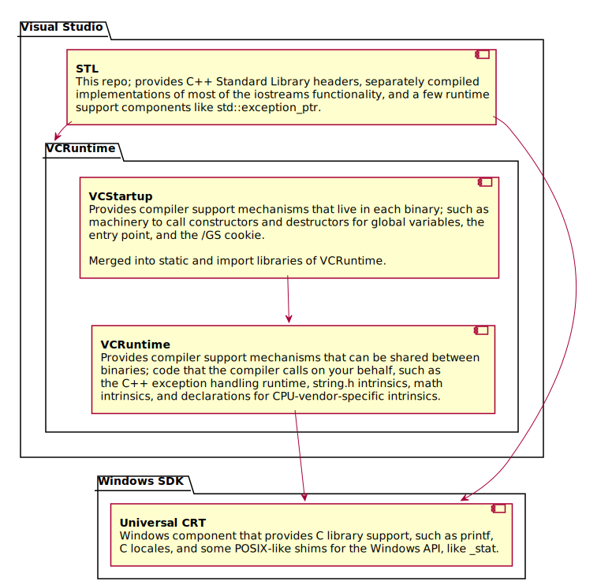

# Microsoft's C++ Standard Library

This is the official repository for Microsoft's implementation of the C++ Standard Library (also known as the STL),
which ships as part of the MSVC toolset and the Visual Studio IDE.

[][Pipelines]

# What This Repo Is Useful For

If you're a programmer who just wants to use the STL, you **don't** need this repo. Simply install the Visual Studio IDE
and select the "Desktop development with C++" workload.

If you want to participate in the STL's development, welcome! You can report issues, comment on pull requests, and learn
about what we're working on. Soon, you'll be able to submit pull requests to fix bugs or add features (see below).

Finally, you can take our code and use it in other apps and libraries (according to the terms of our license, like
everything else).

# GitHub Migration Status

We're in the process of moving all of our work on the STL to GitHub. Current status:

* Code: **Done.** Our source code is available under the Apache License v2.0 with LLVM Exception. (See
[LICENSE.txt][] and [NOTICE.txt][] for more information.)

* Build System: **In progress.** We're working on a CMake build system, which is currently capable of building one
flavor of the STL (native desktop). We need to extend this to build all of the flavors required for the MSVC toolset
(e.g. /clr, /clr:pure, OneCore, Spectre). Until that's done, we're keeping our legacy build system around in the
`stl/msbuild` subdirectory. (We're keeping those files in this repo, even though they're unusable outside of Microsoft,
because they need to be updated whenever source files are added/renamed/deleted. We'll delete the legacy machinery as
soon as possible.)

* Tests: **Coming soon.** We rely on three test suites: devcrt, tr1, and [libcxx][]. We need to replace our current test
harness, which extensively uses Microsoft-internal machinery.

* Continuous Integration: **In progress.** We've set up Azure Pipelines to validate changes to the repository.
However, that infrastructure requires manual review before building community-submitted pull requests, as we haven't
yet hardened it against untrusted changes.

* Contribution Guidelines: **Coming soon.** Working on the STL's code involves following many rules. We have codebase
conventions, Standard requirements, Microsoft-specific requirements, binary compatibility (ABI) requirements, and more.
We're eager to begin accepting features and fixes from the community, but in addition to setting up a CI system, we need
to write down all of the rules that are currently stored in our brains. (The ABI rules may be useful to other C++
libraries.) Until that's in place, pull request reviews will be delayed.

* Issues: **In progress.** We're going to use GitHub issues to track all of the things that we need to work on. This
includes C++20 features, [LWG issues][], conformance bugs, performance improvements, and other todos. There are
approximately 200 active bugs in the STL's Microsoft-internal database; we need to manually replicate all of them to
GitHub issues. Currently, the [cxx20 tag][] and [LWG tag][] are done; every remaining work item is tracked by a GitHub
issue. The [bug tag][] and [enhancement tag][] remain to be populated.

* Plans: **In progress.** We're writing up our [Roadmap][] and [Iteration Plans][].

# Goals

We're implementing the latest C++ Working Draft, currently [N4830][], which will eventually become the next C++
International Standard (which is sometimes referred to as C++2a, but we optimistically refer to it as C++20). The terms
Working Draft (WD) and Working Paper (WP) are interchangeable; we often informally refer to these drafts as "the
Standard" while being aware of the difference. (There are other relevant Standards; for example, supporting `/std:c++14`
and `/std:c++17` involves understanding how the C++14 and C++17 Standards differ from the Working Paper, and we often
need to refer to the C Standard Library and ECMAScript regular expression specifications.)

Our primary goals are conformance, performance, usability, and compatibility.

* Conformance: The Working Paper is a moving target; as features and LWG issue resolutions are added, we need to
implement them. That can involve a lot of work, because the STL is required to behave in very specific ways and to
handle users doing very unusual things.

* Performance: The STL needs to be extremely fast at runtime; speed is one of C++'s core strengths, and most C++
programs use the STL extensively. As a result, we spend more time on optimization than most general-purpose libraries.
(However, we're wary of changes that improve some scenarios at the expense of others, or changes that make code
significantly more complicated and fragile. That is, there's a "complexity budget" that must be spent carefully.)

* Usability: This includes parts of the programming experience like compiler throughput, diagnostic messages, and
debugging checks. For example, we've extensively marked the STL with `[[nodiscard]]` attributes because this helps
programmers avoid bugs.

* Compatibility: This includes binary compatibility and source compatibility. We're keeping VS 2019 binary-compatible
with VS 2017 and VS 2015, which restricts what we can change in VS 2019 updates. (We've found that significant changes
are possible even though other changes are impossible, which we'll be documenting in our Contribution Guidelines soon.)
While there are a few exceptions to this rule (e.g. if a feature is added to the Working Paper, we implement it, and
then the feature is significantly changed before the International Standard is finalized, we reserve the right to break
binary compatibility because `/std:c++latest` offers an experimental preview of such features), binary compatibility
generally overrides all other considerations, even conformance. Source compatibility refers to being able to
successfully recompile user code without changes. We consider source compatibility to be important, but not
all-important; breaking source compatibility can be an acceptable cost, if done for the right reasons in the right way
(e.g. in a controlled manner with escape hatches).

# Non-Goals

There are things that we aren't interested in doing with this project, for various reasons (most importantly, we need to
focus development effort on our goals). Some examples:

* Non-goal: Porting to other platforms.

* Non-goal: Adding non-Standard extensions.

* Non-goal: Implementing Technical Specifications. (We're prioritizing features in the Working Paper. Occasionally, we
might implement some or all of a TS, often when we're working on the specification itself.)

If you're proposing a feature to WG21 (the C++ Standardization Committee), you're welcome (and encouraged!) to use our
code as a base for a proof-of-concept implementation. These non-goals simply mean that we're unable to consider pull
requests for a proposed feature until it has been voted into a Working Paper. After that happens, we'll be delighted to
review a production-ready pull request.

# Reporting Issues

You can report STL bugs here, where they'll be directly reviewed by maintainers. You can also report STL bugs through
[Developer Community][], or the VS IDE (Help > Send Feedback > Report a Problem...).

**Please help us** efficiently process bug reports by following these rules:

* Only STL bugs should be reported here. If it's a bug in the compiler, CRT, or IDE, please report it through Developer
Community or Report A Problem. If it's a bug in the Windows SDK, please report it through the [Feedback Hub][hub] app.
If you aren't sure, try to reduce your test case and see if you can eliminate the STL's involvement while still
reproducing the bug.

* You should be reasonably confident that you're looking at an actual implementation bug, instead of undefined behavior
or surprising-yet-Standard behavior. Comparing against other implementations can help (but remember that implementations
can differ while conforming to the Standard); try Godbolt's [Compiler Explorer][] and [Wandbox][]. If you still aren't
sure, ask the nearest C++ expert.

* You should prepare a self-contained command-line test case, ideally as small as possible. We need a source file, a
command line, what happened (e.g. a compiler error, runtime misbehavior), and what you expected to happen. By
"self-contained", we mean that your source file has to avoid including code that we don't have. Ideally, only CRT and
STL headers should be included. If you have to include other MSVC libraries, or the Windows SDK, to trigger an STL bug,
that's okay. But if you need parts of your own source code to trigger the STL bug, you need to extract that for us. (On
Developer Community, we'll accept zipped IDE projects if you have no other way to reproduce a bug, but this is very
time-consuming for us to reduce.)

* A good title is helpful. We prefer "`<header_name>`: Short description of your issue". You don't usually need to
mention `std::` or C++. For example, "`<type_traits>`: `is_cute` should be true for `enum class FluffyKittens`".

It's okay if you report an apparent STL bug that turns out to be a compiler bug, or surprising-yet-Standard behavior.
Just try to follow these rules, so we can spend more time fixing bugs and implementing features.

# How To Build With The Visual Studio IDE

The STL uses boost-math headers to provide P0226R1 Mathematical Special Functions. We recommend using [vcpkg][] to
acquire this dependency.

1. Install Visual Studio 2019 16.3 or later.
2. Invoke `git clone https://github.com/microsoft/vcpkg`
3. Invoke `cd vcpkg`
4. Invoke `.\bootstrap-vcpkg.bat`
5. Assuming you are targeting x86 and x64, invoke `.\vcpkg.exe install boost-math:x86-windows boost-math:x64-windows`
   to install the boost-math dependency. Add `boost-math:arm-windows boost-math:arm64-windows` to this to target ARM
   and ARM64.
6. Run `.\vcpkg.exe integrate install` which tells Visual Studio which vcpkg instance you wish to use. If you have never
   done this before, you may be prompted to elevate.
7. Open Visual Studio 2019 16.3 or later, and choose the "Clone or check out code" option. Enter the URL to this
   repository, typically `https://github.com/microsoft/STL`
8. Choose the architecture you wish to build in the IDE, and build as you would any other project. All necessary CMake
   settings are set by `CMakeSettings.json` and `vcpkg integrate`

# How To Build With A Native Tools Command Prompt

These instructions assume you're targeting `x64-windows`; you can change this constant below to target other
architectures.

1. Install [CMake][] 3.15 or later, [Ninja][] 1.8.2 or later, and Visual Studio 2019 16.3 or later.
2. Invoke `git clone https://github.com/microsoft/vcpkg`
3. Invoke `cd vcpkg`
4. Invoke `.\bootstrap-vcpkg.bat`
5. Invoke `.\vcpkg.exe install boost-math:x64-windows` to install the boost-math dependency.
6. Open an "x64 Native Tools Command Prompt for VS 2019".
7. Change directories to a location where you'd like a clone of this STL repository.
8. Invoke `git clone https://github.com/microsoft/STL`
9. Invoke `cd STL`
10. Invoke `cmake -G Ninja -DCMAKE_TOOLCHAIN_FILE={where your vcpkg clone is located}\scripts\buildsystems\vcpkg.cmake
-S . -B {wherever you want binaries}` to configure the project. For example,
`cmake -G Ninja -DCMAKE_TOOLCHAIN_FILE=C:\Dev\vcpkg\scripts\buildsystems\vcpkg.cmake -S . -B build.x64`
11. Invoke `ninja -C {wherever you want binaries}` to build the project. For example, `ninja -C build.x64`

# How To Consume

Consumption of the built library is largely based on the build system you're using. There are at least 2 directories
you need to hook up. Assuming you built the x64 target with the Visual Studio IDE, with the STL repository cloned to
`C:\Dev\STL`, build outputs will end up at `C:\Dev\STL\out\build\x64\out`. Ensure that the `inc` directory is searched
for headers, and that `lib\{architecture}` is searched for link libraries, before any defaults supplied by MSVC. The
names of the import and static libraries are the same as those that ship with MSVC. As a result, the compiler `/MD`,
`/MDd`, `/MT`, or `/MTd` switches will work without modification of your build scripts or command-line muscle memory.

Should you choose to use the DLL flavors, the DLLs to deploy are built to `bin\{architecture}`. Note that the DLLs
generated by the CMake build system here have a suffix, defaulting to `_oss`, which distinguishes them from the binaries
that ship with MSVC. That avoids any conflict with the DLLs installed by the [redistributables][] into System32, and
ensures that other components wanting to be a "guest in your process", like print drivers and shell extensions, see the
export surface of the STL they were built with. Otherwise, the "`msvcp140.dll`" you deployed in the same directory as
your .exe would "win" over the versions in System32.

## Complete Example Using x64 DLL Flavor

The compiler looks for include directories according to the `INCLUDE` environment variable, and the linker looks for
import library directories according to the `LIB` environment variable, and the Windows loader will (eventually) look
for DLL dependencies according to directories in the `PATH` environment variable. From an
"x64 Native Tools Command Prompt for VS 2019":

```
C:\Users\bion\Desktop>set INCLUDE=C:\Dev\STL\out\build\x64\out\inc;%INCLUDE%

C:\Users\bion\Desktop>set LIB=C:\Dev\STL\out\build\x64\out\lib\amd64;%LIB%

C:\Users\bion\Desktop>set PATH=C:\Dev\STL\out\build\x64\out\bin\amd64;%PATH%

C:\Users\bion\Desktop>type example.cpp
#include <iostream>

int main() {
    std::cout << "Hello STL OSS world!\n";
}

C:\Users\bion\Desktop>cl /nologo /EHsc /W4 /WX /MDd /std:c++latest .\example.cpp
example.cpp

C:\Users\bion\Desktop>.\example.exe
Hello STL OSS world!

C:\Users\bion\Desktop>dumpbin /IMPORTS .\example.exe | findstr msvcp
    msvcp140d_oss.dll
```

# Block Diagram

The STL is built atop other compiler support libraries that ship with Windows and Visual Studio, like the UCRT,
VCRuntime, and VCStartup. The following diagram describes the dependencies between those components and their ship
vehicles.



# Contributing

This project welcomes contributions and suggestions. Most contributions require you to agree to a
Contributor License Agreement (CLA) declaring that you have the right to, and actually do, grant us
the rights to use your contribution. For details, visit https://cla.opensource.microsoft.com.

When you submit a pull request, a CLA bot will automatically determine whether you need to provide
a CLA and decorate the PR appropriately (e.g., status check, comment). Simply follow the instructions
provided by the bot. You will only need to do this once across all repos using our CLA.

# Code Of Conduct

This project has adopted the [Microsoft Open Source Code of Conduct][]. For more information see the
[Code of Conduct FAQ][] or contact [opencode@microsoft.com][] with any additional questions or comments.

# License

Copyright (c) Microsoft Corporation.

SPDX-License-Identifier: Apache-2.0 WITH LLVM-exception

[CMake]: https://cmake.org/download
[Code of Conduct FAQ]: https://opensource.microsoft.com/codeofconduct/faq/
[Compiler Explorer]: https://godbolt.org
[Developer Community]: https://developercommunity.visualstudio.com/spaces/62/index.html
[Iteration Plans]: https://github.com/microsoft/STL/wiki/Iteration-Plans
[LICENSE.txt]: LICENSE.txt
[LWG issues]: https://cplusplus.github.io/LWG/lwg-toc.html
[LWG tag]: https://github.com/microsoft/STL/issues?q=is%3Aopen+is%3Aissue+label%3ALWG
[Microsoft Open Source Code of Conduct]: https://opensource.microsoft.com/codeofconduct/
[N4830]: https://wg21.link/n4830
[NOTICE.txt]: NOTICE.txt
[Ninja]: https://ninja-build.org
[Pipelines]: https://dev.azure.com/vclibs/STL/_build/latest?definitionId=2&branchName=master
[Roadmap]: https://github.com/microsoft/STL/wiki/Roadmap
[Wandbox]: https://wandbox.org
[bug tag]: https://github.com/microsoft/STL/issues?q=is%3Aopen+is%3Aissue+label%3Abug
[cxx20 tag]: https://github.com/microsoft/STL/issues?q=is%3Aopen+is%3Aissue+label%3Acxx20
[enhancement tag]: https://github.com/microsoft/STL/issues?q=is%3Aopen+is%3Aissue+label%3Aenhancement
[hub]: https://support.microsoft.com/en-us/help/4021566/windows-10-send-feedback-to-microsoft-with-feedback-hub-app
[libcxx]: https://libcxx.llvm.org
[opencode@microsoft.com]: mailto:opencode@microsoft.com
[redistributables]: https://support.microsoft.com/en-us/help/2977003/the-latest-supported-visual-c-downloads
[vcpkg]: https://github.com/microsoft/vcpkg
